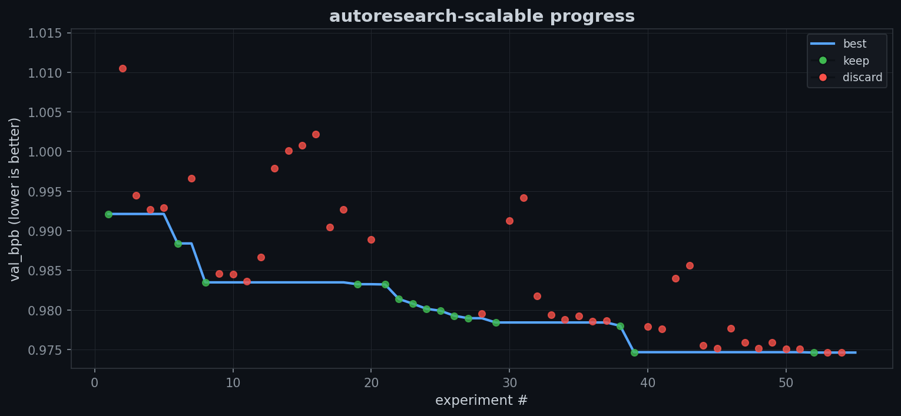

# autoresearch-swarm

> Karpathy's [autoresearch](https://github.com/karpathy/autoresearch), but with a research team instead of a solo researcher.

A multi-agent orchestrated research pipeline that decomposes autonomous experimentation into specialized roles — analyze, implement, launch, learn — with persistent cumulative knowledge across iterations.

```
orchestrator.sh
  ├── ar-analyze    → reads all past learnings, designs next experiment
  ├── ar-implement  → modifies code, commits changes
  ├── ar-launch     → runs experiment, extracts metrics
  └── ar-learnings  → deep analysis of results, writes persistent learnings
```

Each agent is a specialist. The analyzer reads every previous learning and result before designing the next experiment. The learnings agent does deep post-hoc analysis that feeds future iterations. Knowledge compounds.


*54 experiments, overnight. val_bpb dropped from 0.992 to 0.974 — green dots are kept improvements, red dots are discarded experiments.*

The multi-agent approach reaches 0.974 val_bpb in ~39 experiments. The original single-agent autoresearch takes ~75 experiments to reach 0.977. Persistent learnings compound — each iteration builds on structured analysis from every previous one, not just a TSV of numbers.

## Why multi-agent?

The original autoresearch uses a single agent prompt that does everything: analyze history, decide what to try, edit code, run training, interpret results. This works, but:

- **Context bloat** — one agent accumulates all history, code, logs, and analysis in a single context window
- **No specialization** — the same prompt must be good at code editing AND scientific reasoning AND log parsing
- **No persistent memory** — learnings exist only in the agent's context, lost on restart

This repo splits the loop into 4 focused agents with explicit state handoff:

```
┌─────────────┐    hypothesis.md    ┌──────────────┐
│  ar-analyze  │ ─────────────────► │ ar-implement  │
│              │                    │               │
│ reads ALL    │                    │ edits code    │
│ learnings +  │                    │ commits       │
│ results.tsv  │                    │               │
└─────────────┘                    └───────┬───────┘
       ▲                                   │
       │                          experiment.json
       │                                   │
       │                                   ▼
┌──────┴──────┐    last_result.json ┌──────────────┐
│ ar-learnings │ ◄───────────────── │  ar-launch    │
│              │                    │               │
│ deep analysis│                    │ runs training │
│ writes       │                    │ extracts      │
│ learnings.md │                    │ metrics       │
└─────────────┘                    └──────────────┘
```

Each iteration produces a `logs/iter-N/learnings.md` that persists forever. After 50 iterations, the analyzer has 50 detailed post-mortems to learn from — not just a TSV of numbers.

## Quick start

### Option A: Local (single GPU or CPU)

```bash
# 1. Install uv
curl -LsSf https://astral.sh/uv/install.sh | sh

# 2. Install dependencies
uv sync

# 3. Prepare data + tokenizer (one-time, ~2 min)
uv run prepare.py

# 4. Verify with a single training run (~5 min)
uv run train.py

# 5. Start the autonomous loop
./orchestrator.sh
```

### Option B: Kubernetes (scalable)

See [k8s/README.md](k8s/README.md) for cluster setup. The orchestrator runs locally and submits GPU jobs to your cluster.

```bash
# After k8s setup:
AR_BACKEND=k8s ./orchestrator.sh
```

## How it works

### The loop

```
for each iteration:
  1. ANALYZE  — read results.tsv + all logs/iter-*/learnings.md
               — identify patterns, diminishing returns, unexplored directions
               — write state/current_hypothesis.md

  2. IMPLEMENT — read hypothesis, edit train.py, commit
               — write state/current_experiment.json

  3. LAUNCH   — run experiment (local or k8s), extract metrics
               — append to results.tsv
               — write state/last_result.json (keep/discard decision)

  4. LEARN    — read run.log, analyze training dynamics
               — write logs/iter-N/learnings.md (persistent!)

  orchestrator: if discard → revert train.py; if keep → continue
```

### Persistent learnings (the key innovation)

Every iteration produces a structured `learnings.md`:

```markdown
## Experiment: reduce-weight-decay (iter 8)
Result: val_bpb 0.983 → 0.981 (KEEP)

### Training dynamics
- Loss curve showed faster initial convergence (steps 0-200)
- MFU stable at 42%, no throughput regression
- Gradient norms 15% lower in final 30% of training

### Why it worked
Lower weight decay (0.1 → 0.05) allowed the model to fit training data
more tightly. At ~1 epoch, overfitting risk is low, so regularization
was hurting more than helping.

### Suggestions for next experiments
- Try weight decay 0.02 — may still have room
- Combine with learning rate increase since gradients are smaller
- Consider per-layer weight decay schedules
```

After 50 iterations, the analyzer has a rich corpus of mechanistic explanations, not just "0.983 → 0.981". This is what makes the system improve over time.

### Resumability

The orchestrator detects incomplete iterations and resumes from the right step:
- Has `current_experiment.json` but no `last_result.json`? Resume from launch.
- Has `current_hypothesis.md` but no experiment? Resume from implement.
- Otherwise: start fresh analysis.

## Adapting to your domain

The default setup optimizes LLM training (`val_bpb`), but the architecture is domain-agnostic. To adapt:

1. Edit `config.md` — change the metric, command, and in-scope files
2. Edit `steps/*.md` — adjust agent prompts for your domain
3. Edit `run.sh` — your benchmark/training command

Examples:
| Domain | Metric | Command |
|---|---|---|
| LLM training | val_bpb ↓ | `uv run train.py` |
| Test speed | seconds ↓ | `pnpm test` |
| Bundle size | KB ↓ | `pnpm build && du -sb dist` |
| Inference latency | ms/token ↓ | `python bench.py` |

## Project structure

```
orchestrator.sh       — bash loop driving the multi-agent pipeline
config.md             — shared configuration (metric, files, schemas)
run.sh                — experiment runner (local mode)
train.py              — default target: LLM training code
prepare.py            — data prep + runtime utilities (do not modify)
pyproject.toml        — Python dependencies
results.tsv           — experiment history (auto-generated)
steps/
  01_analyze.md       — analyzer agent prompt
  02_implement.md     — implementer agent prompt
  03_launch.md        — launcher agent prompt
  04_learnings.md     — learnings agent prompt
state/                — inter-agent state (ephemeral)
logs/                 — per-iteration learnings (persistent)
k8s/                  — kubernetes backend (optional)
  README.md           — k8s setup guide
  job-template.yaml   — GPU job template
  workspace-pod.yaml  — file management pod
  submit-job.sh       — job submission script
```

## Configuration

Edit `config.md` to customize:
- Target metric and direction
- In-scope source files
- Experiment command
- Results TSV schema
- Simplicity criterion

## Design choices

- **4 agents > 1 agent.** Specialization beats generalization. The analyzer doesn't need to know how to edit code. The implementer doesn't need to parse training logs.
- **Explicit state handoff.** Agents communicate through files (`hypothesis.md`, `experiment.json`, `last_result.json`), not shared context. This makes the system debuggable and resumable.
- **Persistent learnings.** The `logs/iter-*/learnings.md` files are the system's long-term memory. They survive restarts, context resets, and agent swaps.
- **Fixed time budget.** Training always runs for 5 minutes. This makes experiments comparable regardless of what the agent changes.
- **Simplicity criterion.** All else being equal, simpler code wins. A 0.001 improvement from deleting code beats a 0.001 improvement from adding 20 lines.

## Agent framework

The orchestrator calls agents via `claude`. Each agent needs:
- File read/write access
- Bash execution (for `kubectl exec` in k8s mode, or direct commands in local mode)

See `steps/` for agent prompts. You can swap in any agent framework — the interface is just "read state files, do your job, write output files."

## Comparison with other approaches

| | autoresearch-swarm | [karpathy/autoresearch](https://github.com/karpathy/autoresearch) | [pi-autoresearch](https://github.com/davebcn87/pi-autoresearch) |
|---|---|---|---|
| Agents | 4 specialized | 1 monolithic | 1 + extension tools |
| Memory | Persistent learnings per iteration | In-context only | Session doc + JSONL |
| Compute | Local or k8s | Local single GPU | Local process |
| Domain | Any (default: LLM) | LLM training | Any |
| Resumable | Yes (state files) | No | Yes (JSONL) |

## License

MIT
